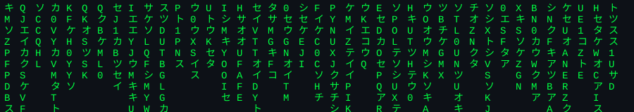

<div align="center">




</div>

<br/>

```bash
$ cat about.md
```

> 🚀 Fullstack developer building enterprise-grade tools and side projects on the side.
> 🌱 Currently growing a few personal projects, from web apps to public APIs.
> 🎯 I care about clean, well-built interfaces as much as clean code.
> 📫 Open to interesting projects and collaborations.

<br/>

```bash
$ ls -la ~/socials
```

<p align="left">
<a href="https://discord.gg/bjp7DfvKG" target="_blank"></a>
<a href="mailto:your-email@example.com"></a>
</p>

<br/>

```bash
$ cat /proc/stack
```


<br/>

```bash
$ ./run_stats.sh --verbose
```

<p align="center">


</p>

<p align="center">

</p>

<br/>

```bash
$ ./contribution_snake.sh
```

<p align="center">

</p>

<br/>

<div align="center">

```bash
$ echo "connection closed"
```

[](https://visitcount.itsvg.in)


</div>
